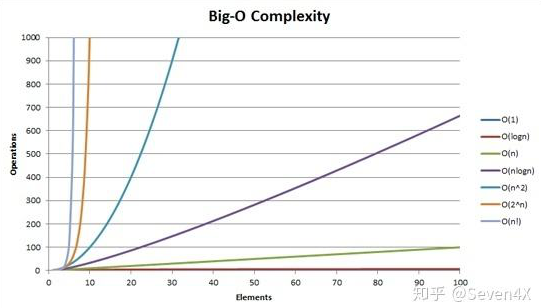

# 复杂度

## 时间复杂度
> 某个算法的时间耗费

* 常数阶O(1)

    所有消耗的都是1，比如redis获取key对应的value的长度，因为redis默认有len字段，所以只有O(1)

* 对数阶O(log2n)

    2^x = n;所以f(x) = log2n
* 线性阶O(n)

    x=y; 所以f(x) = y
* 线性对数阶O(n*logn)

    线性函数及对数函数相乘 n · log n

* 平方阶O(n^2)
* 立方阶O(n^3)
* k次方阶O(n^k)
* 指数阶O(2^n)

## 空间复杂度
> 指算法在计算机内执行时所需存储空间的度量。
