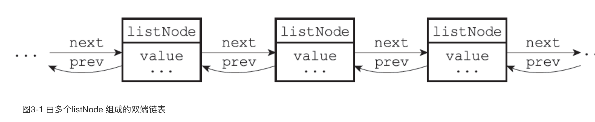
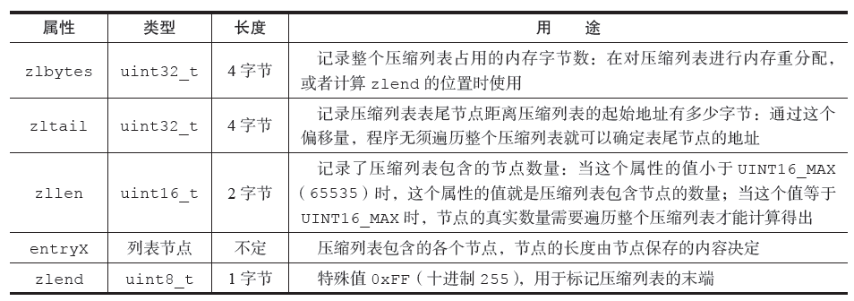
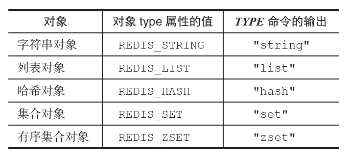
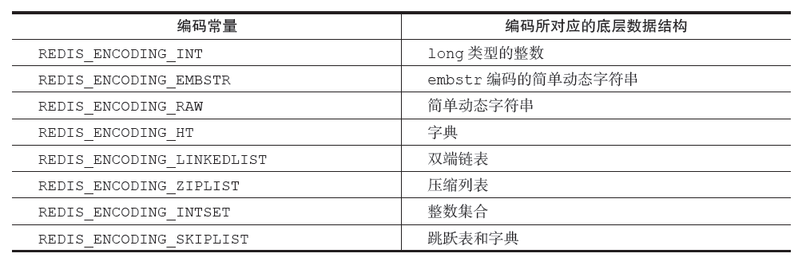
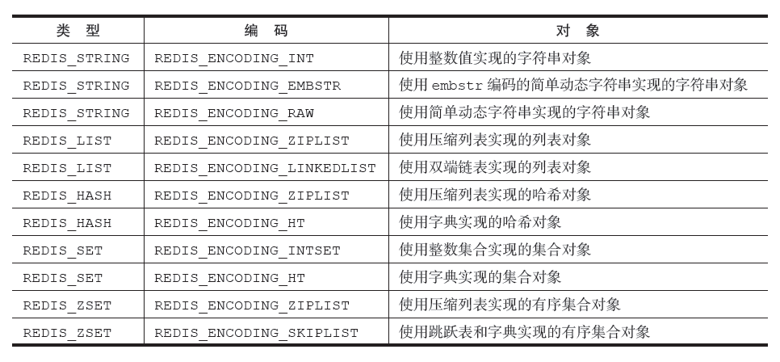

# Reids 数据结构

## Redis 内部数据结构类型
* String
* 链表
* hash
* 字典

### 简单字符串（SDS）：String
* 数据结构（sds）：len, free, buf[]; 以空字符'\0'结尾
* 获取长度的复杂度O(1)：len直接获取
* 修改或者增加原有字段内容时，先判断是否足够（free是否够）：不会出现缓冲区溢出问题
* 空间预分配：如果小于等于1M的，则分配与原来相同大小的2倍（2N+1），如果大于1M的，则分配1M空间，来保证不用每次修改内容，而重新分配，降低时间
* 内存惰性释放：减少字符串长度时，不马上释放空间，减少释放空间的时间，直接用free进行记录
* 二进制：可以保存任何二进制，不会因为'\0'字符而导致中断，因为redis读取数据时，使用的是len进行读取

### 链表：Link
* 数据结构（list）：head, tail, len
* 内部子节点数据结构：prev, next, value;多个listNode可以通过prev和next指针组成双端链表

* 获取长度的复杂度O(1): len直接获取
* 特性：
    * 双端链表：prev,next指针
    * 无环：tail节点的next为NULL，head节点的prev为NULL
    * 带表头、表尾指针，获取表头表尾的复杂度为O(1)

### 哈希表：Hash
* 数据结构（dictht）：table(数组，类似于`java`中的`HashMap`), size(hash表的大小), sizemask(size - 1), used(已使用的大小);
* 内部子节点数据结构（dictEntry）：key, value, next;
* 扩容：没有`BGSAVE`或者`BGREWRITEAOF`负载因子大于等于1，有`BGSAVE`或者`BGREWRITEAOF`负载因子大于等于5 （负载因子= 哈希表已保存节点数量/ 哈希表大小 load_factor = ht[0].used / ht[0].size）
* 渐进式扩容：

### 字典：Dict
* 数据结构（dict）：type（dictType）, privdata, ht[2]（hashtable）, trehashidx
* ht属性是一个包含两个项的数组，数组中的每个项都是一个dictht哈希表，一般情况下，字典只使用ht[0]哈希表，ht[1]哈希表只会在对ht[0]哈希表进行rehash时使用
* 计算hash的index算法`hash = dict->type->hashFunction(k0);` `index = hash&dict->ht[0].sizemask = 8 & 3 = 0;`, 当字典被用作数据库的底层实现，或者哈希键的底层实现时，Redis使用MurmurHash2算法来计算键的哈希值
* 当hash对应的index相同时，采用link的方式用dictEntry的next指向下一个，所以为了速度考虑，程序总是将新节点添加到链表的表头位置（复杂度为O(1)）
* rehash
    * 扩容大小（大于等于ht[0].used*2的2n （2的n次方幂）
    * 渐进式扩容：ht[1]分配相应大小的空间；rehashidx设置为0；每次对字典执行添加、删除、查找或者更新操作时，程序除了执行指定的操作以外，还会顺带将ht[0]哈希表在rehashidx索引上的所有键值对rehash到ht[1]，当rehash工作完成之后，程序将rehashidx属性的值增1；全部完成后，将rehashidx属性的值设为-1，表示rehash操作已完成。

### 跳跃表：Zskiplist
* 数据结构（zskiplist）：header, tail, level, length
* 内部子节点数据结构（zskiplistNode）：level[]（层级对象，最高32层）, backward（回退，类似于prev）, score（分值）, obj（对象存储内容）

### 整数集合：Intset
* 数据结构（intset）：encoding（编码方式）, length(数组长度), contents(元素内容)
* 数据类型encoding：int16_t, int32_t, int64_t
* 数据存储：有序的存储，小的在前面，大的在后面，所有的内容，编码相同，方便管理
* 升级规则：如果编码需要升级，说明新增的字段，要么比所有字段大，要么比所有字段小，所以只会在最前面，或者最后面；升级后，不会存在降级可能

### 压缩表：Ziplist
* 数据结构（ziplist）：zlbytes(), zltail(), zllen(), entryN(), zlend()

* 内部子节点数据结构：previous_entry_length, encoding, content;该结构遍历的时候只能通过从后往前遍历
* 连锁更新：需要了解连锁更新的坏处

### 对象：RedisObject
* 数据结构：type, encoding, ptr(指向底层实现数据结构的指针);
* 对象的type属性：REDIS_STRING, REDIS_HASH, REDIS_SET, REDIS_ZSET, REDIS_LIST

每种类型的对象都至少使用了两种不同的编码

* 各个对象的详解
    * String
        * 包含类型：
            * int:整数值
            * raw:字符串长度大于32
            * embstr: 字符串长度小于等于32，如果是浮点型的数字，redis采用该类型进行保存，在浮点型进行计算时，redis会把字符串类型转换为浮点型，然后计算好，再转换为字符串进行保存
        * 字符串类型转换：
            * int使用`append`命令后，转换为`raw`
            * embstr在修改后，也直接转换为`raw`
        * 常用命令：
            * set
            * get
            * append
            * incrbyfloat
            * incrby
            * decrby
            * strlen
            * setrange
            * getrange
    * 列表
        * 类型：
            * Ziplist
            * linkedlist
            * quicklist
        * 类型转换：ziplist需要满足以下两个条件：1、所有元素的字符长度都要小于64；2、所有元素个数需要小于256
        * 常用命令：
            * lpush
            * rpush
            * lpop
            * rpop
            * lindex
            * llen
            * linsert
            * lrem
            * ltrim
            * lset
    * 哈希
        * 类型
            * ziplist
            * hashtable
        * 类型转换：ziplist需要满足以下两个条件：1、保存的所有键值对的字符长度都要小于64；2、保存的键值对数量小于512
        * 常用命令：
            * hset
            * hget
            * hexists
            * hdel
            * hlen
            * hgetall
    * 集合
        * 类型
            * intset
            * ht
        * 类型转换：intset需要满足以下两个条件：1、集合对象保存的所有对象都是整数值；2、集合对象保存的元素不能超过512
        * 常用命令：
            * sadd
            * scard
            * sismember
            * srandmember
            * smembers
            * spop
            * srem

    * 有序集合
        * 类型
            * ziplist
            * skiplist：通过zset数据结构进行封装，里面有一个zsl，一个dict，这个dict就可以使用O(1)的时间复杂度来查找元素对应的值了。
        * 类型转换：ziplist需要满足以下两个条件：1、保存的有序集合的字符长度都要小于64；2、有序集合保存的元素数量小于128个
        * 常用命令：
            * zadd
            * zcard
            * zcount
            * zrange
            * zrevrange
            * zrank
            * zrevrank
            * zrem
            * zscore
* 多态
* 内存回收`redisObject`存在一个`refcount`
* 共享对象:节约内存

## 数据库

### 数据库结构说明
* db：默认包含了16个数据库，从下标`0`开始，一直到`16`
* dbnum：默认16
* 选择数据库：`select n`
* 过期时间及删除策略、redis的删除策略、aof与rdb对过期key的处理方式不同、主从服务对于过期key的惰性删除不一致

### 持久化
* 类型：
    * RDB
    * AOF
* 顺序：
