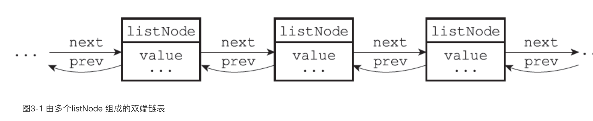

# Reids 数据结构

## Redis 内部数据结构类型
* String
* 链表
* hash
* 字典

### 简单字符串（SDS）：String
* 数据结构（sds）：len, free, buf[]; 以空字符'\0'结尾
* 获取长度的复杂度O(1)：len直接获取
* 修改或者增加原有字段内容时，先判断是否足够（free是否够）：不会出现缓冲区溢出问题
* 空间预分配：如果小于等于1M的，则分配与原来相同大小的2倍（2N+1），如果大于1M的，则分配1M空间，来保证不用每次修改内容，而重新分配，降低时间
* 内存惰性释放：减少字符串长度时，不马上释放空间，减少释放空间的时间，直接用free进行记录
* 二进制：可以保存任何二进制，不会因为'\0'字符而导致中断，因为redis读取数据时，使用的是len进行读取

### 链表：Link
* 数据结构（list）：
* 内部子节点数据结构：prev, next, value;多个listNode可以通过prev和next指针组成双端链表

* 获取长度的复杂度O(1):
